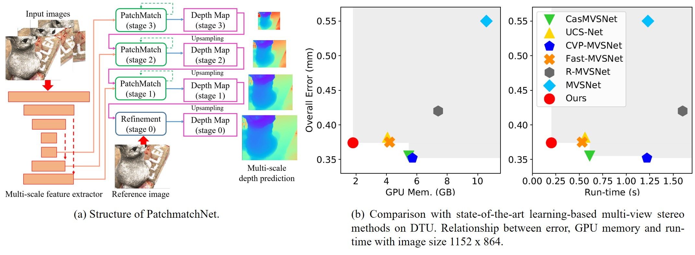

# PatchmatchNet (CVPR2021 Oral)
official source code of paper 'PatchmatchNet: Learned Multi-View Patchmatch Stereo'


## Updates
- 13.12.2021: New unified format for training and evaluation datasets, support for arbitrary image sizes
  and multi-camera setups, and new names for script parameters.
- 27.09.2021: The code now allows for Torchscript export and includes a pre-trained TorchScript module.

## Introduction
PatchmatchNet is a novel cascade formulation of learning-based Patchmatch which aims at decreasing memory consumption and
computation time for high-resolution multi-view stereo. If you find this project useful for your research, please cite:
```
@misc{wang2020patchmatchnet,
      title={PatchmatchNet: Learned Multi-View Patchmatch Stereo}, 
      author={Fangjinhua Wang and Silvano Galliani and Christoph Vogel and Pablo Speciale and Marc Pollefeys},
      journal={CVPR},
      year={2021}
}
```

## Installation
### Requirements
* python 3.8
* CUDA >= 10.1

```
pip install -r requirements.txt
```

## Reproducing Results
* Download our pre-processed dataset:
  [DTU's evaluation set](https://drive.google.com/file/d/1jN8yEQX0a-S22XwUjISM8xSJD39pFLL_/view?usp=sharing),
  [Tanks & Temples](https://drive.google.com/file/d/1gAfmeoGNEFl9dL4QcAU4kF0BAyTd-r8Z/view?usp=sharing) and
  [ETH3D benchmark](https://polybox.ethz.ch/index.php/s/pmTGWobErOnhEg0). Each dataset is already organized as follows:
```
root_directory
├──scan1 (scene_name1)
├──scan2 (scene_name2) 
      ├── images                 
      │   ├── 00000000.jpg       
      │   ├── 00000001.jpg       
      │   └── ...                
      ├── cams                   
      │   ├── 00000000_cam.txt   
      │   ├── 00000001_cam.txt   
      │   └── ...                
      └── pair.txt  
```
Note: 
- The subfolders for Tanks & Temples and ETH3D will not be named `scanN` but the lists included under
  `./lists/eth3d` and `./lists/tanks` will have the correct naming conventions.
- If the folders for images and cameras, and the pair file don't follow the standard naming conventions you can modify
  the settings of `MVSDataset` in `datasets/mvs.py` to specify the custom `image_folder`, `cam_folder`, and `pair_path`
- The `MVSDataset` is configured by default for JPEG images. If you're using a different format (e.g., PNG) you can change
  the `image_extension` parameter of `MVSDataset` accordingly.

Camera file `cam.txt` stores the camera parameters, which includes extrinsic, intrinsic, minimum depth and maximum depth:
```
extrinsic
E00 E01 E02 E03
E10 E11 E12 E13
E20 E21 E22 E23
E30 E31 E32 E33

intrinsic
K00 K01 K02
K10 K11 K12
K20 K21 K22

DEPTH_MIN DEPTH_MAX 
```

`pair.txt ` stores the view selection result. For each reference image, N (10 or more) best source views are stored in the file:
```
TOTAL_IMAGE_NUM
IMAGE_ID0                       # index of reference image 0 
10 ID0 SCORE0 ID1 SCORE1 ...    # 10 best source images for reference image 0 
IMAGE_ID1                       # index of reference image 1
10 ID0 SCORE0 ID1 SCORE1 ...    # 10 best source images for reference image 1 
...
``` 

* In `eval.sh`, set `DTU_TESTING`, `ETH3D_TESTING` or `TANK_TESTING` as the root directory of corresponding dataset
  and uncomment the evaluation command for corresponding dataset (default is to evaluate on DTU's evaluation set).
  If you want to change the output location (default is same as input one), modify the `--output_folder` parameter.
  For Tanks the `--scan_list` can be intermediate or advanced and for ETH3D it can be test or train.
* `CKPT_FILE` is the checkpoint file (our pretrained model is `./checkpoints/params_000007.ckpt`), change it if you want
  to use your own model. If you want to use the model from the TorchScript module instead, you can specify the checkpoint
  file as `./checkpoints/module_000007.pt` and set the option `--input_type module`.
* Test on GPU by running `sh eval.sh`. The code includes depth map estimation and depth fusion. The outputs are the
  point clouds in `ply` format. 
* For quantitative evaluation on DTU dataset, download [SampleSet](http://roboimagedata.compute.dtu.dk/?page_id=36) and
  [Points](http://roboimagedata.compute.dtu.dk/?page_id=36). Unzip them and place `Points` folder in `SampleSet/MVS Data/`.
  The structure looks like:
```
SampleSet
├──MVS Data
      └──Points
```

In `evaluations/dtu/BaseEvalMain_web.m`, set `dataPath` as path to `SampleSet/MVS Data/`, `plyPath` as directory that
stores the reconstructed point clouds and `resultsPath` as directory to store the evaluation results. Then run
`evaluations/dtu/BaseEvalMain_web.m` in matlab.

The results look like:

| Acc. (mm) | Comp. (mm) | Overall (mm) |
|-----------|------------|--------------|
| 0.427     | 0.277      | 0.352        |

* For detailed quantitative results on Tanks & Temples and ETH3D, please check the leaderboards
  ([Tanks & Temples](https://www.tanksandtemples.org/details/1170/), [ETH3D](https://www.eth3d.net/result_details?id=216))

## Evaluation on Custom Dataset
* For evaluation, we support preparing the custom dataset from COLMAP's results. The script `colmap_input.py`
  (modified based on the script from [MVSNet](https://github.com/YoYo000/MVSNet)) converts COLMAP's sparse reconstruction
  results into the same format as the datasets that we provide. After reconstruction, COLMAP will generate a folder
  `COLMAP/dense/`, which contains `COLMAP/dense/images/` and `COLMAP/dense/sparse`. Then you need to run like this:
```
python colmap_input.py --input_folder COLMAP/dense/ 
```
* The default output location is the same as the input one. If you want to change that, set the `--output_folder` parameter.
* The default behavior of the converter will find all possible related images for each source image. If you want to constrain
  the max number of related images set the `--num_src_images` parameter.
* In `eval.sh`, set `CUSTOM_TESTING` as the root directory of the dataset, set `--output_folder` as the directory to store
  the reconstructed point clouds (default is same as input directory), set `--image_max_dim` to an appropriate size (this
  is determined by the available GPU memory and the desired processing speed) or use the native size by removing the
  parameter, and uncomment the evaluation command. Test on GPU by running `sh eval.sh`.

## Training
Download pre-processed [DTU's training set](https://polybox.ethz.ch/index.php/s/ugDdJQIuZTk4S35). The dataset is already
organized as follows:
```
root_directory
├── Cameras_1
│    ├── train
│    │    ├── 00000000_cam.txt
│    │    ├── 00000000_cam.txt
│    │    └── ...
│    └── pair.txt
├── Depths_raw
│    ├── scan1
│    │    ├── depth_map_0000.pfm
│    │    ├── depth_visual_0000.png
│    │    ├── depth_map_0001.pfm
│    │    ├── depth_visual_0001.png
│    │    └── ...
│    ├── scan2
│    └── ...
└── Rectified
     ├── scan1_train
     │    ├── rect_001_0_r5000.png
     │    ├── rect_001_1_r5000.png
     │    ├── ...
     │    ├── rect_001_6_r5000.png
     │    ├── rect_002_0_r5000.png
     │    ├── rect_002_1_r5000.png
     │    ├── ...
     │    ├── rect_002_6_r5000.png
     │    └── ...
     ├── scan2_train
     └── ...
```
To use this dataset directly look into the [Legacy Training](#legacy-training) section below. For the current version of training the
dataset needs to be converted to a format compatible with `MVSDataset` in `./datasets/mvs.py` using the script
`convert_dtu_dataset.py` as follows:
```
python convert_dtu_dataset.py --input_folder <original_dataset> --output_folder <converted_dataset> --scan_list ./lists/dtu/all.txt
```
The converted dataset will now be in a format similar to the evaluation datasets:
```
root_directory
├── scan1 (scene_name1)
├── scan2 (scene_name2) 
│     ├── cams (camera parameters)
│     │   ├── 00000000_cam.txt   
│     │   ├── 00000001_cam.txt   
│     │   └── ...                
│     ├── depth_gt (ground truth depth maps)
│     │   ├── 00000000.pfm   
│     │   ├── 00000001.pfm   
│     │   └── ...                
│     ├── images (images at 7 light indexes) 
│     │   ├── 0 (light index 0)
│     │   │   ├── 00000000.jpg       
│     │   │   ├── 00000001.jpg
│     │   │   └── ...
│     │   ├── 1 (light index 1)
│     │   └── ...                
│     ├── masks (depth map masks) 
│     │   ├── 00000000.png       
│     │   ├── 00000001.png       
│     │   └── ...                
│     └── pair.txt
└── ...
```
* In `train.sh`, set `MVS_TRAINING` as the root directory of the converted dataset; set `--output_path` as the directory
  to store the checkpoints.
* Train the model by running `sh train.sh`.
* The output consists of one checkpoint (model parameters) and one TorchScript module per epoch named as
  `params_<epoch_id>.ckpt` and `module_<epoch_id>.pt` respectively.

### Legacy Training
To train directly on the [original DTU dataset](https://polybox.ethz.ch/index.php/s/ugDdJQIuZTk4S35) the legacy training
script `train_dtu.py` (using the legacy `MVSDataset` from `datasets/dtu_yao.py`) needs to be called from the `train.sh`
script.
* In `train.sh`, set `MVS_TRAINING` as the root directory of the original dataset; set `--logdir` as the directory to
  store the checkpoints. 
* Uncomment the appropriate section for legacy training and comment out the other entry.
* Train the model by running `sh train.sh`.

### Note:
`--patchmatch_iteration` represents the number of iterations of Patchmatch on multi-stages (e.g., the default number `1,2,2`
means 1 iteration on stage 1, 2 iterations on stage 2 and 2 iterations on stage 3). `--propagate_neighbors` represents the
number of neighbors for adaptive propagation (e.g., the default number `0,8,16` means no propagation for Patchmatch on
stage 1, using 8 neighbors for propagation on stage 2 and using 16 neighbors for propagation on stage 3). As explained in
our paper, we do not include adaptive propagation for the last iteration of Patchmatch on stage 1 due to the requirement
of photometric consistency filtering. So in our default case (also for our pretrained model), we set the number of propagation
neighbors on stage 1 as `0` since the number of iteration on stage 1 is `1`. If you want to train the model with more
iterations on stage 1, change the corresponding number in `--propagate_neighbors` to include adaptive propagation for
Patchmatch expect for the last iteration.

## Acknowledgements
This project is done in collaboration with "Microsoft Mixed Reality & AI Zurich Lab".

Thanks to Yao Yao for open-sourcing his excellent work [MVSNet](https://github.com/YoYo000/MVSNet). Thanks to Xiaoyang Guo
for open-sourcing his PyTorch implementation of MVSNet [MVSNet-pytorch](https://github.com/xy-guo/MVSNet_pytorch).
